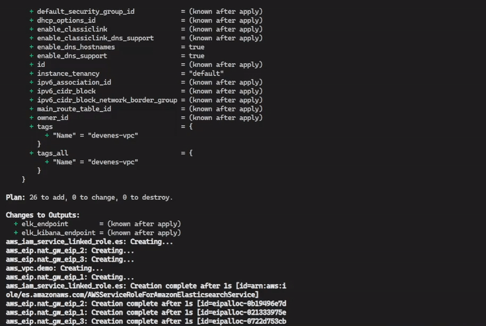
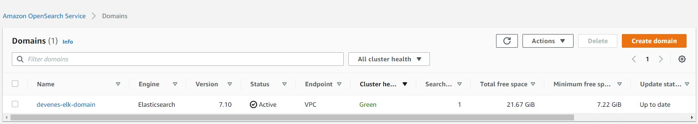
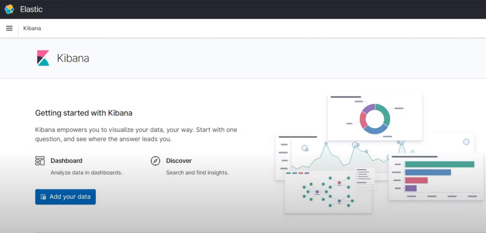

# Create ElasticSearch on AWS VPC with Terraform

## Description

Terraform as an infrastructure provisioning tool communicates with VMware, AWS, GCP, and ensures infrastructure deployment. Terraform is ideal for creating, managing, and improving infrastructure. It involves an open-source code responsible for pushing APIs into configuration files.

IaC allows you to build, change, and manage your infrastructure in a safe, consistent, and repeatable way by defining resource configurations that you can version, reuse, and share. Terraform is HashiCorp's infrastructure as code tool.

## Expeted Terraform Apply Output



## AWS OpenSearch Output



## Kibana Dashboard



## Terraform Plan Actions

Terraform used the selected providers to generate the following execution plan.

Resource actions are indicated with the following symbols:

Terraform will perform the following actions:

```tf
  # aws_eip.nat_gw_eip_1 will be created
  + resource "aws_eip" "nat_gw_eip_1" {
      + allocation_id        = (known after apply)
      + association_id       = (known after apply)
      + carrier_ip           = (known after apply)
      + customer_owned_ip    = (known after apply)
      + domain               = (known after apply)
      + id                   = (known after apply)
      + instance             = (known after apply)
      + network_border_group = (known after apply)
      + network_interface    = (known after apply)
      + private_dns          = (known after apply)
      + private_ip           = (known after apply)
      + public_dns           = (known after apply)
      + public_ip            = (known after apply)
      + public_ipv4_pool     = (known after apply)
      + tags_all             = (known after apply)
      + vpc                  = true
    }

  # aws_eip.nat_gw_eip_2 will be created
  + resource "aws_eip" "nat_gw_eip_2" {
      + allocation_id        = (known after apply)
      + association_id       = (known after apply)
      + carrier_ip           = (known after apply)
      + customer_owned_ip    = (known after apply)
      + domain               = (known after apply)
      + id                   = (known after apply)
      + instance             = (known after apply)
      + network_border_group = (known after apply)
      + network_interface    = (known after apply)
      + private_dns          = (known after apply)
      + private_ip           = (known after apply)
      + public_dns           = (known after apply)
      + public_ip            = (known after apply)
      + public_ipv4_pool     = (known after apply)
      + tags_all             = (known after apply)
      + vpc                  = true
    }

  # aws_eip.nat_gw_eip_3 will be created
  + resource "aws_eip" "nat_gw_eip_3" {
      + allocation_id        = (known after apply)
      + association_id       = (known after apply)
      + carrier_ip           = (known after apply)
      + customer_owned_ip    = (known after apply)
      + domain               = (known after apply)
      + id                   = (known after apply)
      + instance             = (known after apply)
      + network_border_group = (known after apply)
      + network_interface    = (known after apply)
      + private_dns          = (known after apply)
      + private_ip           = (known after apply)
      + public_dns           = (known after apply)
      + public_ip            = (known after apply)
      + public_ipv4_pool     = (known after apply)
      + tags_all             = (known after apply)
      + vpc                  = true
    }

  # aws_elasticsearch_domain.es will be created
  + resource "aws_elasticsearch_domain" "es" {
      + access_policies       = jsonencode(
            {
              + Statement = [
                  + {
                      + Action    = "es:*"
                      + Effect    = "Allow"
                      + Principal = "*"
                      + Resource  = "arn:aws:es:us-east-1:232976713052:domain/devenes-elk-domain/*"
                    },
                ]
              + Version   = "2012-10-17"
            }
        )
      + advanced_options      = (known after apply)
      + arn                   = (known after apply)
      + domain_id             = (known after apply)
      + domain_name           = "devenes-elk-domain"
      + elasticsearch_version = "7.10"
      + endpoint              = (known after apply)
      + id                    = (known after apply)
      + kibana_endpoint       = (known after apply)
      + tags                  = {
          + "Domain" = "devenes-elk-domain"
        }
      + tags_all              = {
          + "Domain" = "devenes-elk-domain"
        }

      + advanced_security_options {
          + enabled                        = (known after apply)
          + internal_user_database_enabled = (known after apply)

          + master_user_options {
              + master_user_arn      = (known after apply)
              + master_user_name     = (known after apply)
              + master_user_password = (sensitive value)
            }
        }

      + auto_tune_options {
          + desired_state       = (known after apply)
          + rollback_on_disable = (known after apply)

          + maintenance_schedule {
              + cron_expression_for_recurrence = (known after apply)
              + start_at                       = (known after apply)

              + duration {
                  + unit  = (known after apply)
                  + value = (known after apply)
                }
            }
        }

      + cluster_config {
          + dedicated_master_enabled = false
          + instance_count           = 3
          + instance_type            = "t3.medium.elasticsearch"
          + zone_awareness_enabled   = true

          + zone_awareness_config {
              + availability_zone_count = 3
            }
        }

      + domain_endpoint_options {
          + custom_endpoint                 = (known after apply)
          + custom_endpoint_certificate_arn = (known after apply)
          + custom_endpoint_enabled         = (known after apply)
          + enforce_https                   = (known after apply)
          + tls_security_policy             = (known after apply)
        }

      + ebs_options {
          + ebs_enabled = true
          + volume_size = 10
          + volume_type = (known after apply)
        }

      + encrypt_at_rest {
          + enabled    = (known after apply)
          + kms_key_id = (known after apply)
        }

      + node_to_node_encryption {
          + enabled = (known after apply)
        }

      + snapshot_options {
          + automated_snapshot_start_hour = 23
        }

      + vpc_options {
          + availability_zones = (known after apply)
          + security_group_ids = (known after apply)
          + subnet_ids         = (known after apply)
          + vpc_id             = (known after apply)
        }
    }

  # aws_iam_service_linked_role.es will be created
  + resource "aws_iam_service_linked_role" "es" {
      + arn              = (known after apply)
      + aws_service_name = "es.amazonaws.com"
      + create_date      = (known after apply)
      + id               = (known after apply)
      + name             = (known after apply)
      + path             = (known after apply)
      + tags_all         = (known after apply)
      + unique_id        = (known after apply)
    }

  # aws_internet_gateway.demo will be created
  + resource "aws_internet_gateway" "demo" {
      + arn      = (known after apply)
      + id       = (known after apply)
      + owner_id = (known after apply)
      + tags     = {
          + "Name" = "devenes-igw"
        }
      + tags_all = {
          + "Name" = "devenes-igw"
        }
      + vpc_id   = (known after apply)
    }

  # aws_nat_gateway.gw_1 will be created
  + resource "aws_nat_gateway" "gw_1" {
      + allocation_id        = (known after apply)
      + connectivity_type    = "public"
      + id                   = (known after apply)
      + network_interface_id = (known after apply)
      + private_ip           = (known after apply)
      + public_ip            = (known after apply)
      + subnet_id            = (known after apply)
      + tags_all             = (known after apply)
    }

  # aws_nat_gateway.gw_2 will be created
  + resource "aws_nat_gateway" "gw_2" {
      + allocation_id        = (known after apply)
      + connectivity_type    = "public"
      + id                   = (known after apply)
      + network_interface_id = (known after apply)
      + private_ip           = (known after apply)
      + public_ip            = (known after apply)
      + subnet_id            = (known after apply)
      + tags_all             = (known after apply)
    }

  # aws_nat_gateway.gw_3 will be created
  + resource "aws_nat_gateway" "gw_3" {
      + allocation_id        = (known after apply)
      + connectivity_type    = "public"
      + id                   = (known after apply)
      + network_interface_id = (known after apply)
      + private_ip           = (known after apply)
      + public_ip            = (known after apply)
      + subnet_id            = (known after apply)
      + tags_all             = (known after apply)
    }

  # aws_route_table.nated_1 will be created
  + resource "aws_route_table" "nated_1" {
      + arn              = (known after apply)
      + id               = (known after apply)
      + owner_id         = (known after apply)
      + propagating_vgws = (known after apply)
      + route            = [
          + {
              + carrier_gateway_id         = ""
              + cidr_block                 = "0.0.0.0/0"
              + destination_prefix_list_id = ""
              + egress_only_gateway_id     = ""
              + gateway_id                 = ""
              + instance_id                = ""
              + ipv6_cidr_block            = ""
              + local_gateway_id           = ""
              + nat_gateway_id             = (known after apply)
              + network_interface_id       = ""
              + transit_gateway_id         = ""
              + vpc_endpoint_id            = ""
              + vpc_peering_connection_id  = ""
            },
        ]
      + tags             = {
          + "Name" = "devenes-nated-rt-1"
        }
      + tags_all         = {
          + "Name" = "devenes-nated-rt-1"
        }
      + vpc_id           = (known after apply)
    }

  # aws_route_table.nated_2 will be created
  + resource "aws_route_table" "nated_2" {
      + arn              = (known after apply)
      + id               = (known after apply)
      + owner_id         = (known after apply)
      + propagating_vgws = (known after apply)
      + route            = [
          + {
              + carrier_gateway_id         = ""
              + cidr_block                 = "0.0.0.0/0"
              + destination_prefix_list_id = ""
              + egress_only_gateway_id     = ""
              + gateway_id                 = ""
              + instance_id                = ""
              + ipv6_cidr_block            = ""
              + local_gateway_id           = ""
              + nat_gateway_id             = (known after apply)
              + network_interface_id       = ""
              + transit_gateway_id         = ""
              + vpc_endpoint_id            = ""
              + vpc_peering_connection_id  = ""
            },
        ]
      + tags             = {
          + "Name" = "devenes-nated-rt-2"
        }
      + tags_all         = {
          + "Name" = "devenes-nated-rt-2"
        }
      + vpc_id           = (known after apply)
    }

  # aws_route_table.nated_3 will be created
  + resource "aws_route_table" "nated_3" {
      + arn              = (known after apply)
      + id               = (known after apply)
      + owner_id         = (known after apply)
      + propagating_vgws = (known after apply)
      + route            = [
          + {
              + carrier_gateway_id         = ""
              + cidr_block                 = "0.0.0.0/0"
              + destination_prefix_list_id = ""
              + egress_only_gateway_id     = ""
              + gateway_id                 = ""
              + instance_id                = ""
              + ipv6_cidr_block            = ""
              + local_gateway_id           = ""
              + nat_gateway_id             = (known after apply)
              + network_interface_id       = ""
              + transit_gateway_id         = ""
              + vpc_endpoint_id            = ""
              + vpc_peering_connection_id  = ""
            },
        ]
      + tags             = {
          + "Name" = "devenes-nated-rt-3"
        }
      + tags_all         = {
          + "Name" = "devenes-nated-rt-3"
        }
      + vpc_id           = (known after apply)
    }

  # aws_route_table.public will be created
  + resource "aws_route_table" "public" {
      + arn              = (known after apply)
      + id               = (known after apply)
      + owner_id         = (known after apply)
      + propagating_vgws = (known after apply)
      + route            = [
          + {
              + carrier_gateway_id         = ""
              + cidr_block                 = "0.0.0.0/0"
              + destination_prefix_list_id = ""
              + egress_only_gateway_id     = ""
              + gateway_id                 = (known after apply)
              + instance_id                = ""
              + ipv6_cidr_block            = ""
              + local_gateway_id           = ""
              + nat_gateway_id             = ""
              + network_interface_id       = ""
              + transit_gateway_id         = ""
              + vpc_endpoint_id            = ""
              + vpc_peering_connection_id  = ""
            },
        ]
      + tags             = {
          + "Name" = "devenes-public-rt"
        }
      + tags_all         = {
          + "Name" = "devenes-public-rt"
        }
      + vpc_id           = (known after apply)
    }

  # aws_route_table_association.nated_1 will be created
  + resource "aws_route_table_association" "nated_1" {
      + id             = (known after apply)
      + route_table_id = (known after apply)
      + subnet_id      = (known after apply)
    }

  # aws_route_table_association.nated_2 will be created
  + resource "aws_route_table_association" "nated_2" {
      + id             = (known after apply)
      + route_table_id = (known after apply)
      + subnet_id      = (known after apply)
    }

  # aws_route_table_association.public_1 will be created
  + resource "aws_route_table_association" "public_1" {
      + id             = (known after apply)
      + route_table_id = (known after apply)
      + subnet_id      = (known after apply)
    }

  # aws_route_table_association.public_2 will be created
  + resource "aws_route_table_association" "public_2" {
      + id             = (known after apply)
      + route_table_id = (known after apply)
      + subnet_id      = (known after apply)
    }

  # aws_route_table_association.public_3 will be created
  + resource "aws_route_table_association" "public_3" {
      + id             = (known after apply)
      + route_table_id = (known after apply)
      + subnet_id      = (known after apply)
    }

  # aws_security_group.es will be created
  + resource "aws_security_group" "es" {
      + arn                    = (known after apply)
      + description            = "Allow inbound traffic to ElasticSearch from VPC CIDR"
      + egress                 = (known after apply)
      + id                     = (known after apply)
      + ingress                = [
          + {
              + cidr_blocks      = [
                  + "10.0.0.0/16",
                ]
              + description      = ""
              + from_port        = 0
              + ipv6_cidr_blocks = []
              + prefix_list_ids  = []
              + protocol         = "-1"
              + security_groups  = []
              + self             = false
              + to_port          = 0
            },
        ]
      + name                   = "devenes-es-sg"
      + name_prefix            = (known after apply)
      + owner_id               = (known after apply)
      + revoke_rules_on_delete = false
      + tags_all               = (known after apply)
      + vpc_id                 = (known after apply)
    }

  # aws_subnet.nated_1 will be created
  + resource "aws_subnet" "nated_1" {
      + arn                                            = (known after apply)
      + assign_ipv6_address_on_creation                = false
      + availability_zone                              = "us-east-1a"
      + availability_zone_id                           = (known after apply)
      + cidr_block                                     = "10.0.3.0/24"
      + enable_dns64                                   = false
      + enable_resource_name_dns_a_record_on_launch    = false
      + enable_resource_name_dns_aaaa_record_on_launch = false
      + id                                             = (known after apply)
      + ipv6_cidr_block_association_id                 = (known after apply)
      + ipv6_native                                    = false
      + map_public_ip_on_launch                        = false
      + owner_id                                       = (known after apply)
      + private_dns_hostname_type_on_launch            = (known after apply)
      + tags                                           = {
          + "Name" = "devenes-nated-subnet-us-east-1a"
        }
      + tags_all                                       = {
          + "Name" = "devenes-nated-subnet-us-east-1a"
        }
      + vpc_id                                         = (known after apply)
    }

  # aws_subnet.nated_2 will be created
  + resource "aws_subnet" "nated_2" {
      + arn                                            = (known after apply)
      + assign_ipv6_address_on_creation                = false
      + availability_zone                              = "us-east-1b"
      + availability_zone_id                           = (known after apply)
      + cidr_block                                     = "10.0.4.0/24"
      + enable_dns64                                   = false
      + enable_resource_name_dns_a_record_on_launch    = false
      + enable_resource_name_dns_aaaa_record_on_launch = false
      + id                                             = (known after apply)
      + ipv6_cidr_block_association_id                 = (known after apply)
      + ipv6_native                                    = false
      + map_public_ip_on_launch                        = false
      + owner_id                                       = (known after apply)
      + private_dns_hostname_type_on_launch            = (known after apply)
      + tags                                           = {
          + "Name" = "devenes-nated-subnet-us-east-1b"
        }
      + tags_all                                       = {
          + "Name" = "devenes-nated-subnet-us-east-1b"
        }
      + vpc_id                                         = (known after apply)
    }

  # aws_subnet.nated_3 will be created
  + resource "aws_subnet" "nated_3" {
      + arn                                            = (known after apply)
      + assign_ipv6_address_on_creation                = false
      + availability_zone                              = "us-east-1c"
      + availability_zone_id                           = (known after apply)
      + cidr_block                                     = "10.0.5.0/24"
      + enable_dns64                                   = false
      + enable_resource_name_dns_a_record_on_launch    = false
      + enable_resource_name_dns_aaaa_record_on_launch = false
      + id                                             = (known after apply)
      + ipv6_cidr_block_association_id                 = (known after apply)
      + ipv6_native                                    = false
      + map_public_ip_on_launch                        = false
      + owner_id                                       = (known after apply)
      + private_dns_hostname_type_on_launch            = (known after apply)
      + tags                                           = {
          + "Name" = "devenes-nated-subnet-us-east-1c"
        }
      + tags_all                                       = {
          + "Name" = "devenes-nated-subnet-us-east-1c"
        }
      + vpc_id                                         = (known after apply)
    }

  # aws_subnet.public_1 will be created
  + resource "aws_subnet" "public_1" {
      + arn                                            = (known after apply)
      + assign_ipv6_address_on_creation                = false
      + availability_zone                              = "us-east-1a"
      + availability_zone_id                           = (known after apply)
      + cidr_block                                     = "10.0.0.0/24"
      + enable_dns64                                   = false
      + enable_resource_name_dns_a_record_on_launch    = false
      + enable_resource_name_dns_aaaa_record_on_launch = false
      + id                                             = (known after apply)
      + ipv6_cidr_block_association_id                 = (known after apply)
      + ipv6_native                                    = false
      + map_public_ip_on_launch                        = true
      + owner_id                                       = (known after apply)
      + private_dns_hostname_type_on_launch            = (known after apply)
      + tags                                           = {
          + "Name" = "devenes-public-subnet-us-east-1a"
        }
      + tags_all                                       = {
          + "Name" = "devenes-public-subnet-us-east-1a"
        }
      + vpc_id                                         = (known after apply)
    }

  # aws_subnet.public_2 will be created
  + resource "aws_subnet" "public_2" {
      + arn                                            = (known after apply)
      + assign_ipv6_address_on_creation                = false
      + availability_zone                              = "us-east-1b"
      + availability_zone_id                           = (known after apply)
      + cidr_block                                     = "10.0.1.0/24"
      + enable_dns64                                   = false
      + enable_resource_name_dns_a_record_on_launch    = false
      + enable_resource_name_dns_aaaa_record_on_launch = false
      + id                                             = (known after apply)
      + ipv6_cidr_block_association_id                 = (known after apply)
      + ipv6_native                                    = false
      + map_public_ip_on_launch                        = true
      + owner_id                                       = (known after apply)
      + private_dns_hostname_type_on_launch            = (known after apply)
      + tags                                           = {
          + "Name" = "devenes-public-subnet-us-east-1b"
        }
      + tags_all                                       = {
          + "Name" = "devenes-public-subnet-us-east-1b"
        }
      + vpc_id                                         = (known after apply)
    }

  # aws_subnet.public_3 will be created
  + resource "aws_subnet" "public_3" {
      + arn                                            = (known after apply)
      + assign_ipv6_address_on_creation                = false
      + availability_zone                              = "us-east-1c"
      + availability_zone_id                           = (known after apply)
      + cidr_block                                     = "10.0.2.0/24"
      + enable_dns64                                   = false
      + enable_resource_name_dns_a_record_on_launch    = false
      + enable_resource_name_dns_aaaa_record_on_launch = false
      + id                                             = (known after apply)
      + ipv6_cidr_block_association_id                 = (known after apply)
      + ipv6_native                                    = false
      + map_public_ip_on_launch                        = true
      + owner_id                                       = (known after apply)
      + private_dns_hostname_type_on_launch            = (known after apply)
      + tags                                           = {
          + "Name" = "devenes-public-subnet-us-east-1c"
        }
      + tags_all                                       = {
          + "Name" = "devenes-public-subnet-us-east-1c"
        }
      + vpc_id                                         = (known after apply)
    }

  # aws_vpc.demo will be created
  + resource "aws_vpc" "demo" {
      + arn                                  = (known after apply)
      + cidr_block                           = "10.0.0.0/16"
      + default_network_acl_id               = (known after apply)
      + default_route_table_id               = (known after apply)
      + default_security_group_id            = (known after apply)
      + dhcp_options_id                      = (known after apply)
      + enable_classiclink                   = (known after apply)
      + enable_classiclink_dns_support       = (known after apply)
      + enable_dns_hostnames                 = true
      + enable_dns_support                   = true
      + id                                   = (known after apply)
      + instance_tenancy                     = "default"
      + ipv6_association_id                  = (known after apply)
      + ipv6_cidr_block                      = (known after apply)
      + ipv6_cidr_block_network_border_group = (known after apply)
      + main_route_table_id                  = (known after apply)
      + owner_id                             = (known after apply)
      + tags                                 = {
          + "Name" = "devenes-vpc"
        }
      + tags_all                             = {
          + "Name" = "devenes-vpc"
        }
    }

Plan: 26 to add, 0 to change, 0 to destroy.

Changes to Outputs:
  + elk_endpoint        = (known after apply)
  + elk_kibana_endpoint = (known after apply)
```
